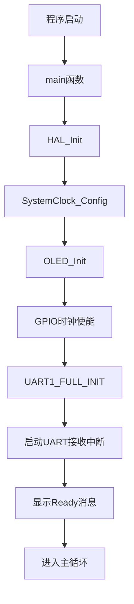
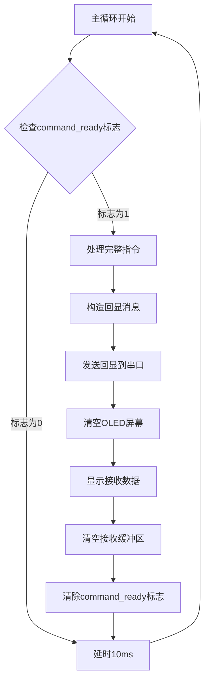
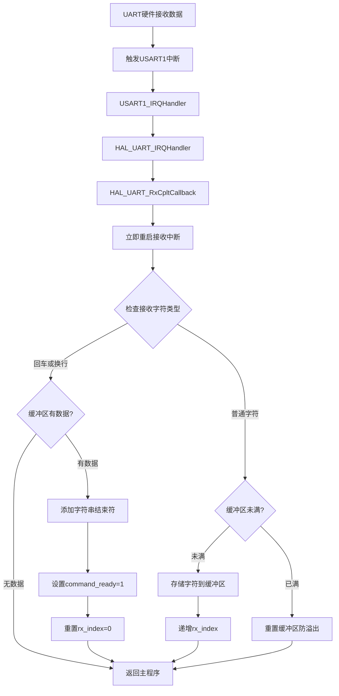
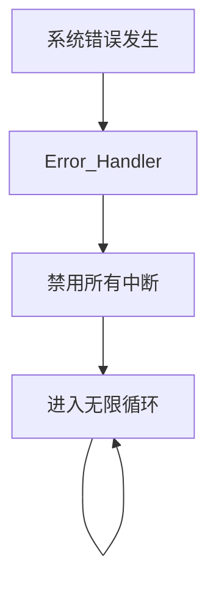

# UART中断处理流程分析

## 1. 主程序初始化流程

## 2. 主循环处理流程

## 3. UART中断处理流程

## 4. 错误处理流程

## 5. 详细流程说明

### 5.1 中断初始化
- 在main函数中调用 `HAL_UART_Receive_IT(&huart1, &rx_data, 1)`
- 配置UART1以中断模式接收1个字节
- 使能UART接收中断，设置接收缓冲区为 `rx_data`

### 5.2 中断触发机制
1. **硬件中断触发**：UART1接收到1个字节数据时，硬件自动触发 `USART1_IRQn` 中断
2. **中断服务程序**：CPU跳转到 `USART1_IRQHandler`
3. **HAL库处理**：调用 `HAL_UART_IRQHandler` 检查中断状态
4. **用户回调**：调用 `HAL_UART_RxCpltCallback` 进行用户自定义处理

### 5.3 数据处理策略
- **立即重启接收**：在回调函数中首先重启下一次接收，确保不丢失数据
- **字符分类处理**：
  - 指令结束符（`\n` 或 `\r`）：设置完整指令标志
  - 普通字符：存储到缓冲区并递增索引
- **缓冲区保护**：防止溢出，自动重置机制

### 5.4 异步处理模式
- **中断层**：负责数据接收和缓存
- **主循环层**：负责数据处理和响应
- **同步机制**：通过 `command_ready` 标志进行层间通信

这种设计确保了UART通信的实时性和可靠性，是嵌入式系统中典型的中断驱动串口通信实现方式。